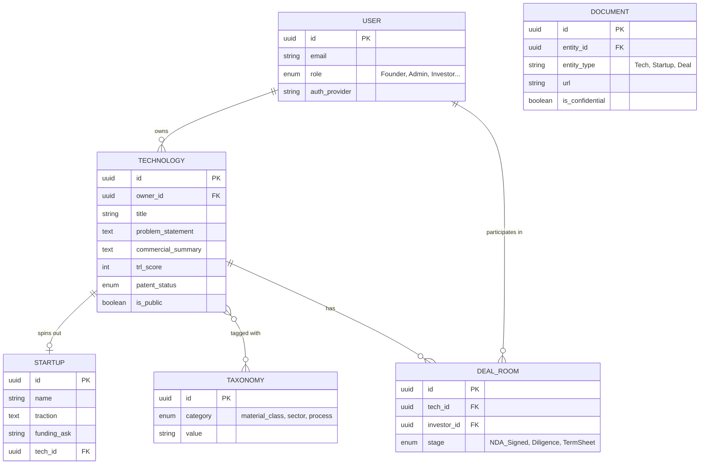

# IIT Kharagpur MME Commercialization Platform: End-to-End Specification

This document serves as the comprehensive architectural, product, and operational specification for the IIT Kharagpur Department of Metallurgical and Materials Engineering Technology Transfer Platform.

> [!IMPORTANT]  
> **Platform Ethos**: Credibility-first, diligence-first. This is not a generic startup board. It is an institutional bridge connecting deep-tech metallurgy research with capital and corporate deployment.

---

## 1. Product Requirements Document (PRD)

**Vision:** A secure, role-based, searchable, document-rich platform where metallurgy-specific innovations originating at IIT Kharagpur are verified, showcased, and commercialized. 

**Core Objectives:**
1. Facilitate frictionless discovery of TRL-ready technologies, patents, and startups.
2. Maintain strict institutional verification (SRIC/IPR) before public visibility.
3. Bridge the communication gap by translating academic achievements into commercial value props.
4. Provide a secure, NDA-gated deal room for investors and licensing partners.
5. Track commercialization metrics from research output to revenue.

**Scope (Metallurgy-Only):**
Extractive, Physical, Iron/Steel, Adv. Materials Processing, Battery Materials, Metal Recycling, Corrosion, Surface Eng, Powder Metallurgy, Biomaterials, Hydrogen Tech, High-Temp Materials, AM, Computational Materials.

---

## 2. User Journey Maps

**1. Founder / Faculty Inventor Journey**
*   **Onboarding:** Logs in via Insti SSO -> Selects Lab/Department -> Edits Profile.
*   **Drafting:** Creates new "Technology Profile" -> Fills technical details, files patents -> Submits.
*   **Review:** Responds to Admin/SRIC comments -> Adjusts claims -> Approved for publishing.
*   **Engagement:** Receives alert for NDA request -> Reviews investor profile -> Approves NDA -> Grants Data Room access.

**2. Investor / VC Journey**
*   **Onboarding:** Registers org -> Verified by Admin -> Sets preferences (e.g., "Seed stage, Battery Materials").
*   **Discovery:** Browses curated feed -> Filters by TRL ≥ 6 -> Reads public commercial summaries.
*   **Diligence:** Requests NDA for Tech X -> Signs digital NDA -> Accesses technical validation data & cap table.
*   **Action:** Schedules call via platform -> Moves status to "Term Sheet."

**3. Corporate / Licensing Manager Journey**
*   **Discovery:** Searches "corrosion protection pipelines" -> Finds relevant patent.
*   **Engagement:** Clicks "Request Licensing Package" -> Submits intended use case -> Engages with IPR Office.

**4. Admin / SRIC Officer Journey**
*   **Verification:** Dashboard shows "3 Pending Reviews" -> Checks patent status -> Flags "overclaimed TRL" -> Sends back to Founder.
*   **Monitoring:** Views analytics -> Exports Q3 Commercialization Report for Dean.

---

## 3. Site Map & Page-by-Page Feature Spec

*   **A. Public Discovery Layer**
    *   `/` (Home): Hero banner, Search, Featured Tech/Startups, "Industry Pain Points" navigation.
    *   `/technologies`: Paginated, faceted search directory.
    *   `/startups`: Verified startup directory.
*   **B. Entity Pages**
    *   `/tech/{id}`: Modular layout (Summary -> Why it matters -> TRL/Patent Status -> Public Docs -> NDA Request).
    *   `/startup/{id}`: Team, Problem/Solution, Traction, Ask, Data Room link.
*   **C. Gated Workspaces**
    *   `/dashboard/founder`: My Assets, Inquiries, Deal Rooms.
    *   `/dashboard/investor`: Watchlist, NDA Status, Pipeline.
    *   `/dashboard/admin`: Approval Queue, User Management, Taxonomy config.
    *   `/deal-room/{deal_id}`: NDA gate, Document viewer (watermarked), Q&A forum.

---

## 4. Database Schema (Logical)

---

## 5. API Endpoint Spec (RESTful)

*   `GET /api/v1/technologies`: Query params `?trl_min=5&sector=automotive&patent=granted`
*   `GET /api/v1/technologies/:id`: Returns full schema (public fields only if unauthenticated).
*   `POST /api/v1/technologies`: Create draft (Auth: Faculty/Founder).
*   `PATCH /api/v1/technologies/:id/status`: Update workflow state (Auth: Admin).
*   `POST /api/v1/nda/request`: Initiate NDA (Payload: investor_id, tech_id, intent).
*   `GET /api/v1/deal-room/:id/documents`: Fetch signed AWS S3 URLs (Auth: Valid NDA).
*   `POST /api/v1/ai/summarize`: Pass abstract, returns commercial summary.

---

## 6. Role & Permission Matrix

| Action | Visitor | Founder/Faculty | Investor/Corporate | Admin/SRIC |
| :--- | :---: | :---: | :---: | :---: |
| View Public Search | ✅ | ✅ | ✅ | ✅ |
| Create/Edit Tech Profile | ❌ | ✅ (Own) | ❌ | ✅ (All) |
| Approve for Publishing | ❌ | ❌ | ❌ | ✅ |
| Request NDA | ❌ | ❌ | ✅ | ❌ |
| Approve NDA | ❌ | ✅ (Own) | ❌ | ✅ (Override) |
| Access Deal Room Docs | ❌ | ✅ (Own) | ✅ (If Approved) | ✅ |

---

## 7. UX Wireframe Descriptions

*   **Home Page:** Clean white background, IIT blue accents. Large search bar in the center: *"Find advanced materials by TRL, application, or process."* Below: segmented cards for "Steel," "Battery Tech," "Extractive."
*   **Technology Page:** 
    *   **Left Column (70%):** Title, TRL Badge (e.g., green `TRL 6`), Commercial Summary (large font), "Why it matters" bullet list, Validation Data graphs.
    *   **Right Column (30%):** Sticky sidebar. Status parameters: Patent (Granted), Readiness Score (8/10), Suggested Model (Licensing). Primary CTA: "Request Deep-Dive / NDA".
*   **Admin Dashboard:** Kanban board interface (`Drafts` -> `Dept Review` -> `IPR Review` -> `Published`). Clicking a card opens a split-screen: left is user input, right is AI suggestion / admin override tools.

---

## 8. MVP / Phase 2 / Phase 3 Roadmap

*   **MVP (Months 1-3): Foundation & Directory**
    *   Auth, Profiles, Admin workflow.
    *   Creation of Tech & Startup listings.
    *   Faceted search and public directory.
    *   Basic inquiry forms (routing to email).
*   **Phase 2 (Months 4-6): Deal Flow & Diligence**
    *   NDA module & e-signatures.
    *   Secure Document Data Rooms with watermarking.
    *   Investor CRM & Pipeline tracking dashboards.
    *   Corporate Licensing Request flow.
*   **Phase 3 (Months 7-9): AI & Intelligence**
    *   AI Summarizer (Tech -> Commercial rewrite).
    *   Recommendation engine (Investors matched to new IPs).
    *   Advanced analytics export for Institute reporting.

---

## 9. Content Templates

**Technology Page Template:**
*   **One-Line Pitch:** [Action verb] [Material/Process] to achieve [Performance/Cost benefit] for [Industry].
    *(e.g., "Electro-refining titanium alloys to reduce raw material cost by 30% for aerospace manufacturing.")*
*   **The Bottleneck (Why it matters):** Today, [Industry] struggles with [Problem] due to [Limitation]. 
*   **The Innovation:** Our team has developed [Solution] using [Core Mechanism], resulting in [Data point].
*   **Deployment Potential:** Best suited for [Buyer Persona]. Immediate application in [Use Case].

---

## 10. AI Prompt Library

**Prompt 1: Rewrite for Commercial Viability**
> "You are an expert deep-tech VC. Read the following academic abstract about a metallurgical innovation. Rewrite it into a 3-bullet 'Why It Matters' section focusing on: 1) Cost reduction/efficiency gain, 2) Industrial bottleneck solved, and 3) Deployment readiness. Keep tone measured, factual, and strictly avoid hype."

**Prompt 2: Extract Diligence Flags**
> "Analyze this technology profile. Identify any missing critical information regarding TRL, patent geography, or validation sample sizes that a corporate licensing team would demand before a meeting."

---

## 11. Admin Workflow & Approval Logic

1.  **Draft:** Record created.
2.  **Dept. Validation:** Admin verifies the PI belongs to MME and the research is legitimate.
3.  **IPR Check:** SRIC verifies patent numbers. If "Filed," toggles `hide_technical_diagrams` based on IP strategy.
4.  **Publishing Check:** Approver ensures the "Commercial Summary" doesn't violate academic integrity or exaggerate claims.
5.  **Live:** Technology becomes searchable. Audit log generated (`Approved by [Admin] on [Timestamp]`).

---

## 12. Analytics Dashboard Spec

**For Institute Leadership:**
*   **Top-level KPIs:** Total Tech Live, Active NDAs, Total Startups, Funnel (Research -> Patent -> Pilot -> Licensed).
*   **Sector Heatmap:** E.g., showing 45% of investor queries are targeting "Battery Materials", signaling the department to fund more research there.
*   **Conversion Metrics:** Time-to-license, Average deal velocity.

---

## 13. Security and Access-Control Spec

*   **Data Residency:** Hosted inside India to comply with potential insti/state data regulations.
*   **Document Security:** PDFs rendered via secure viewer, disabling downloads unless explicitly granted. Dynamic watermarking with the viewer's email and IP address.
*   **Isolation:** `Confidential` fields in the DB are encrypted at rest and stripped from API queries unless the request carries a valid `deal_room_token`.

---

## 14. Notification Logic

*   **Trigger: New NDA Request:** -> Email to Founder ("Investor [X] requested access") + Bell notification.
*   **Trigger: NDA Signed:** -> Email to Investor ("Access granted to Data Room: [Tech Name]").
*   **Trigger: Profile Inactive (90 days):** -> Alert to Founder ("Update validation data for your patent").

---

## 15. Search and Ranking Logic

*   **Text/Faceted Search:** Elasticsearch/Typesense index. Factors: Keywords + Taxonomy tags + TF-IDF of the abstract.
*   **Ranking Weights:** 
    *   Patent Granted (+20%)
    *   High TRL (+15%)
    *   Has rich media/videos (+10%)
    *   Recently updated (+5%)
*   **Semantic Search:** Vector embeddings of "Problems Solved" to handle queries like *"how to stop rusting in marine environments"* -> Matches "PVD localized cathodic preservation".

---

## 16. Commercialization Pipeline Logic

Entities move through a strict state machine:
`Lead` -> `Contacted` -> `NDA Executed` -> `Data Room Access` -> `Diligence Meetings` -> `Term Sheet / Licensing Agreement` -> `Closed Won`.
*   Founders can drag-and-drop investors across these stages.
*   Institute admins can view the aggregated pipeline to forecast licensing revenue.

---

## 17. Investor Matching Logic

*   **Profiles:** Investors tag themselves with `target_trl_min`, `domains` (e.g., Powder Metallurgy), and `ticket_size`.
*   **Matching Mechanism:** Nightly cron job runs Jaccard Similarity between new Tech Profile taxonomy tags and Investor preferences.
*   **Output:** Generates a weekly "Curated Deal Flow" digest strictly targeted to their thesis.

---

## 18. Licensing Inquiry Workflow

1.  Corporate presses "Request Licensing Info".
2.  Form captures: Organization, Intended market geography, Field of use.
3.  Ticket generated in SRIC/Admin portal.
4.  Admin initiates internal dialog with PI.
5.  If agreed, NDA is sent to Corporate.
6.  Post-NDA, standard IIT licensing term sheet is deployed via Deal Room.

---
## Build-Ready Summary

This specification outlines a state-of-the-art **Deep-Tech Commercialization Hub**. 
To begin execution:
1.  **Design Team:** Initiate Figma designs focusing on the *Public Discovery Layer* and *Tech Detail Pages*, adhering to the blue/steel premium aesthetic. Keep charts data-heavy and fonts clinical (e.g., Inter, Roboto).
2.  **Engineering Team:** Bootstrap a Next.js (Frontend) + Node/PostgreSQL (Backend) stack. Setup the DB schemas referencing Section 4, and construct the RBAC (Role-Based Access Control) defined in Section 6.
3.  **Product Team:** Configure the specific metallurgical taxonomy (Section 3/15) with the MME department heads to ensure the drop-downs align with the faculty's specialized language, then onboard the first 10 pilot technologies. 
